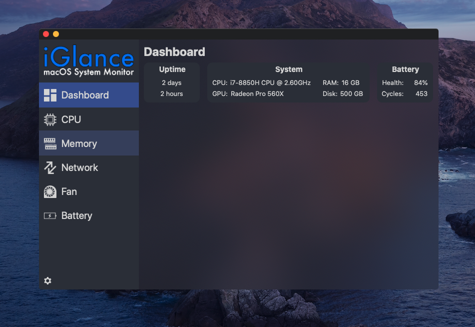

   
   
   
   

iGlance is a small system monitor that displays current stats about your Mac on the menu bar. It is built to be highly customizable so that everyone can adjust it to his/her needs. A full list of all the features is below. If you encounter any bugs or have suggestions for new features, feel free to write them down in the Issues tab.

# Features

- Display CPU utilization as a graph
- Read CPU temperature
- Monitor memory usage
- Monitor network usage
- Monitor fan speed
- Low and/or high battery notification at custom thresholds
- App adjusts to light & dark mode

# Installation

There are two possible ways to install iGlance:

1. Download the iGlance.dmg from https://github.com/iglance/iGlance/releases and manually move the app into the applications folder.
2. Install iGlance using [brew](https://brew.sh):

   `brew install --cask iglance`

# Contribute

There are two ways you can contribute to this project:

1. You can star this repository and tell all your friends about our cool app ;)
2. You can work on one of the open issues. Please read our [Contribution Guide](https://github.com/iglance/iGlance/blob/master/.github/CONTRIBUTING.md) and our [Code of Conduct](https://github.com/iglance/iGlance/blob/master/.github/CODE_OF_CONDUCT.md) before you start.

Contributor Hall of Fame:  

# Warning about iStat X

We have nothing to do with an app called "iStats X: CPU & Memory" which is available in the App Store. iStats X is a copy of an old version of our app. The values of the cpu temperature or the fan speeds are just random values since it is technically not possible to read the cpu temperature using an app which is distrubuted over the App Store without downloading a helper which is distributed outside of the App Store. Those values have nothing to do with the real temperature of the cpu or the real fan speeds. If you bought this app and found iGlance through an update popup, you could try to get iStats X refunded over at https://support.apple.com/en-us/HT204084.

# Roadmap

### Version 2.1:

- ~~Import/Export Settings~~
- ~~Add tests for settings import/export~~
- ~~App re-design for Big Sur~~
- Use database to save all the read information (for displaying graphs and to prevent reading value multiple times when changing e.g. the width of the menu bar items)
- Use drag and drop to arrange/add the menu bar items

### Version 2.2

- Add disk io menu bar item
- Display the disk io (read/write speed)
- Add the public ip address to the menu of the network menu bar item

# Credits

- [beltex](https://github.com/beltex) for providing the [SMCKit](https://github.com/beltex/SMCKit) and [SystemKit](https://github.com/beltex/SystemKit) Library
- [CocoaLumberjack](https://github.com/CocoaLumberjack/CocoaLumberjack) for their awesome logging framework
- [Oskar Groth](https://github.com/OskarGroth) for providing his [AppMover](https://github.com/OskarGroth/AppMover) framework
- [Sindre Sorhus](https://github.com/sindresorhus) for providing his [LaunchAtLogin](https://github.com/sindresorhus/LaunchAtLogin) library
- Facebook for making their [device mockups](https://facebook.design/devices) publicly available for the design community
- And of course all the other [contributors](https://github.com/iglance/iGlance/graphs/contributors)

# License

This software is published under the <b>GNU GPLv3</b>.
